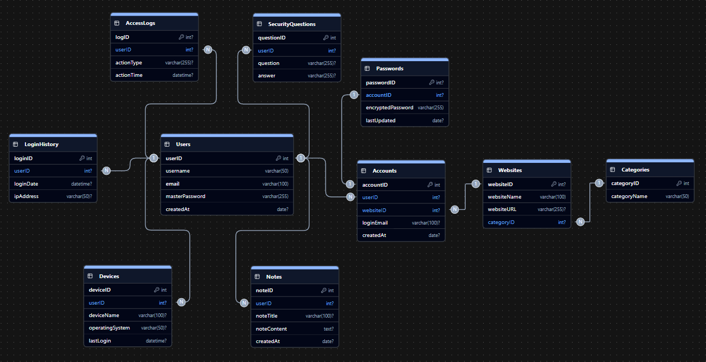
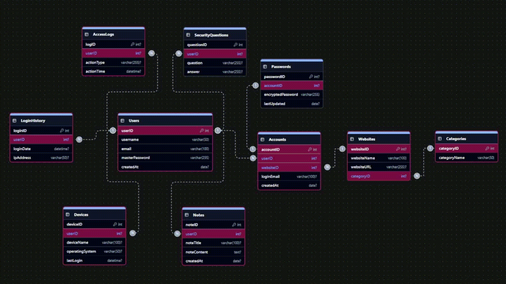

# Password Manager Database System (SQL Server)


A relational database project designed for secure password management using Microsoft SQL Server. The system demonstrates database design principles, normalization, relational modeling, constraints, and SQL query implementation through a realistic password management application.

---

## Features

- Relational database design
- Entity Relationship Diagram (ERD)
- Third Normal Form (3NF)
- Primary & Foreign Keys
- Constraints
- SQL Server implementation
- Data insertion scripts
- CRUD (DML) operations
- Simple SQL queries
- Complex SQL queries
- Advanced relational queries

---

## Database Structure

| Table | Purpose |
|--------|----------|
| Users | Stores user accounts |
| Categories | Organizes websites into categories |
| Websites | Stores website/application information |
| Accounts | Stores user login accounts |
| Passwords | Stores encrypted passwords |
| Notes | Stores secure personal notes |
| Devices | Stores user devices |
| LoginHistory | Tracks login records |
| AccessLogs | Records user actions |
| SecurityQuestions | Stores recovery questions |

**Total Tables:** 10

---

## Entity Relationship Diagram



---

### Live ER Diagram



---

## Project Structure

```text
PasswordManagerDB

├── Logical Database Design
│   ├── ER Diagram
│   └── ERD

├── Physical Database Design
│   ├── DDL Scripts
│   └── Data Insertion Scripts

├── SQL Implementation
│   ├── DML Operations
│   ├── Simple Queries
│   ├── Complex Queries

├── Files
│   ├── Full Database Schema
│   ├── Data Insertion
│   ├── Executable SQL Script
│   ├── Project Report
│   └── Project Presentation

├── Questions&Answers.md
├── README.md
└── LICENSE
```

---

## Technologies

- Microsoft SQL Server
- T-SQL
- SQL Server Management Studio (SSMS)

---

## Concepts Demonstrated

- Database Modeling
- Entity Relationship Design
- Normalization
- Constraints
- Joins
- Views
- Aggregate Functions
- Grouping
- Subqueries
- CTEs
- Data Integrity
- Relational Design

---

## Screenshots

Screenshots will be added in future updates.

---

## Documentation

The repository includes:

- Complete project report
- Presentation slides
- ER Diagram
- Database schema
- SQL implementation scripts
- Executable SQL script

---

## License

This project is released under the Apache-2.0 License.

---

## Author

Alaa

GitHub:
https://github.com/ALAADROID
